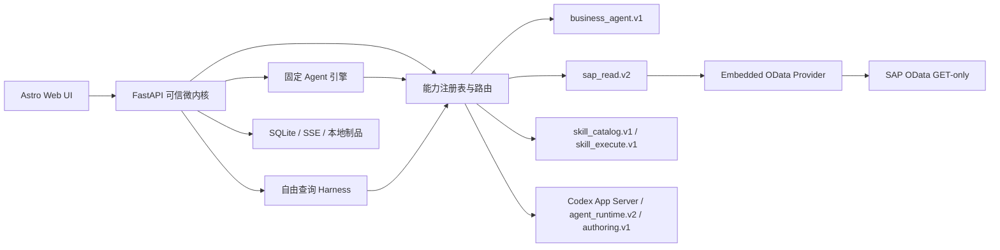

# SAP Business Agents

[中文](#中文) | [English](#english) | [在线目录 / Live catalog](https://yin-wen-bin.github.io/SAPBusinessAgents/)

SAP Business Agents 是一个按 SAP 业务模块组织的可运行 Agent 目录。它参照 [SAPSkillhub](https://github.com/yin-wen-bin/SAPSkillhub) 的内容组织方式：站点自动扫描 `agents/` 下的清单，生成模块导航、搜索、双语详情页，以及工作流步骤与 Tool 的映射，无需维护手写中央索引。

## 中文

### 项目功能

- 按 Common、FI、CO、SD、MM、PP 组织 SAP 业务 Agent。
- 每个 Agent 是独立、可运行、可测试的业务纵向切片。
- 中英文目录支持按模块、事务码、表、Tool 和业务关键词搜索。
- Agent 详情页展示输入、输出、SAP 范围、安全边界和完整工作流。
- 工作流的每一步明确列出实际使用的 Tool、数据入口或控制组件。
- 高风险 SAP 动作保持只读、人工确认和可审计边界。
- 单机原型提供“固定 Agent”和“自由 SAP 查询”两种执行模式，并在同一运行详情页展示计划、证据、规则、完整性和模型解释。
- 可视化工作流编排器可连接固定 Agent 的类型化输入输出端口，经 Codex 辅助真机验证后发布为不依赖 Codex 的确定性工作流。

在线目录：[https://yin-wen-bin.github.io/SAPBusinessAgents/](https://yin-wen-bin.github.io/SAPBusinessAgents/)

### 当前 Agent

| 模块 | Agent | 业务场景 |
|---|---|---|
| FI | [AP Payment Assistant](agents/FI/ap-payment/) | 供应商付款状态、未清项目与付款风险 |
| FI | [AR Collection Assistant](agents/FI/ar-collection/) | 应收账龄、收款匹配与催收建议 |
| FI | [GR/IR Clearing Assistant](agents/FI/gr-ir-clearing/) | GR/IR 未清原因、证据与清理建议 |
| FI | [Month-end Closing Assistant](agents/FI/month-end-closing/) | FI/CO/MM/SD 月结异常检查与关账待办 |
| MM | [Procure-to-Pay Status Assistant](agents/MM/procure-to-pay-status/) | PO → GR → IV → FI → Payment 全链路状态 |
| MM | [Material Shortage Procurement Response](agents/MM/material-shortage-procurement-response/) | MRP 短缺、PR、PO 交期与货源响应 |
| MM | [Inventory Health Check](agents/MM/inventory-health-balancing/) | 可选的慢动、呆滞与临期检查；只分析当前库存 |
| MM | [Intelligent Sourcing and RFQ Evaluation](agents/MM/intelligent-sourcing-rfq/) | RFQ/报价固定权重评估 |
| MM | [Supplier Performance and Delivery Risk](agents/MM/supplier-performance-risk/) | 计划行净收货 OTIF 与交付风险 |
| SD | [Delivered-not-Billed Monitor](agents/SD/delivered-not-billed/) | 已发货未开票识别与滞留分级 |
| SD | [Billing Block Diagnosis](agents/SD/billing-block-diagnosis/) | 订单、项目与交货开票冻结诊断 |
| SD | [Billing Completeness Check](agents/SD/billing-completeness-check/) | 数量、价格、币种与税务完整性检查 |
| SD | [Billing Output Monitor](agents/SD/billing-output-monitor/) | 发票输出失败与客户送达监控 |
| SD | [Delivery Delay Prediction](agents/SD/delivery-delay-prediction/) | 可解释交货延期风险评分 |
| SD | [Due Delivery Prioritization](agents/SD/due-delivery-prioritization/) | 到期交货清单智能排序 |
| SD | [Shortage Allocation Advisor](agents/SD/shortage-allocation-advisor/) | 缺货场景的只读库存分配建议 |
| SD | [Billing Dispute Classification](agents/SD/billing-dispute-classification/) | 客户拒票与发票争议分类 |
| SD | [Returns and Credit Anomaly Monitor](agents/SD/returns-credit-anomaly/) | 退货及贷项异常检测 |
| SD | [Order-to-Cash Anomaly Monitor](agents/SD/order-to-cash-anomaly-monitor/) | O2C端到端异常聚合与待办 |
| SD | [Order-to-Cash Status](agents/SD/order-to-cash-status/) | 订单、交货、开票、FI与回款状态 |

### 仓库结构

```text
agents/
  Common/
  FI/
  CO/
  SD/
  MM/
  PP/
site/                 # Astro 静态目录站点
src/sap_business_agents_platform/ # FastAPI、SQLite、SSE 与双模式运行时
config/plugins/   # 可信本机插件清单与版本化能力声明
config/odata-services.json # 审核后的 OData V2/V4 内部服务注册表
config/skills.json    # 允许自动执行的只读 Skill 白名单
data/catalog-seed/    # 去敏、GET-only 的检索与规划 Seed（非执行权威）
.codex/agents/        # 项目级 Custom Agent 配置
.github/workflows/    # 校验与 GitHub Pages 部署
```

每个 Agent 遵守以下目录契约：

```text
agents/<模块>/<agent-slug>/
  agent.json   # 目录、详情、工作流和 Tool 映射的数据源
  README.md    # 实现、运行和 SAP 接入说明
  src/         # Agent 实现
  tests/       # 自动化测试
  docs/        # 可选：数据契约或运行手册
  tools/       # 可选：受控辅助工具
```

### Agent 清单契约

`agent.json` 可使用目录展示用的 `schemaVersion: 1`，或使用增加了确定性执行定义的 `schemaVersion: 2`。其 `slug` 和 `module` 必须与目录一致，并提供：

- 中英文标题与摘要；
- 负责人、版本、状态、标签和适用系统；
- SAP 模块、事务码和核心对象或表；
- 中英文输入、输出和安全边界；
- 至少一个工作流步骤；
- 每个步骤至少一个 Tool，并描述 Tool 类型和中英文用途；
- 可选的步骤级 `sapScope` 将业务模块、事务码和核心对象/表映射到实际工作流步骤；启用后必须覆盖 Agent 的完整 SAP 范围。

站点在构建前校验全部清单。新增或修改 `agent.json` 后，目录页和详情页会自动更新。

`schemaVersion: 2` 还必须声明 `execution.mode: deterministic` 以及顺序执行的 `sap_read`、`skill` 或 `rule` 步骤。`sap_read` 只能使用 `GET`，并且每个服务/实体引用必须显式声明 `odata_version: "2.0" | "4.0"`；运行时不会让 Codex 改写固定 Agent 的工具和步骤。Catalog Seed 只用于检索，目标系统实时 `$metadata` 始终是可执行 Schema 的唯一权威。版本注册、V2/V4 适配、一次性清洁迁移与 BAH 管理员同步流程见 [OData Catalog v2](docs/odata-catalog-v2.md)。

### 单机双模式原型

原型的 FastAPI 服务只监听 `127.0.0.1`。固定 Agent 由确定性工作流引擎运行；“直接询问 SAP”默认创建持久 Codex App Server thread，并通过 Native Web Search、仓库内 SAP Tool Broker MCP 和动态工具准入 Gateway 执行观察—修订循环。所有 SAP 请求仍需通过实时元数据、业务关系和 GET-only 校验。默认限制为 12 turn、40 次平台工具调用和 600 秒；超限保持 `INCONCLUSIVE`，不自动回退旧 Planner。运行状态、SSE 事件和证据引用保存在 `.local-data/`，Agent 草稿只写入 `.prototype/authoring/`。完整契约见 [Codex Harness 自由查询原型](docs/codex-harness.md)。

本机运行时采用不依赖 Cordis 的 Python/FastAPI 微内核。核心只负责运行状态、SSE、确定性工作流、证据完整性和只读策略；能力通过 `config/plugins/` 中的版本化清单注册。SAP 数据通道固定为进程内的 Embedded OData Provider，另有 SAPSkillhub、Codex Runtime 和业务 Agent 包。运行记录会保存实际 `plugin_id`、版本、能力、调用编号和耗时。



首次启动：

```powershell
python -m venv .venv
.\.venv\Scripts\python.exe -m pip install -e ".[dev]"
Copy-Item .env.example .env
```

完成首次安装和 `.env` 配置后，可直接双击仓库根目录的
`start-sap-business-agents.cmd`。启动器只检查或启动 SAPBusinessAgents API 和
Astro Web UI，不会启动 SAPClaw。默认情况下，Web UI 使用内容指纹复用
`.local-data/site-builds/` 中的静态构建并通过 Astro Preview 运行；首次启动或
Agent、前端源码、依赖及本地 API 地址变化时才会重新构建。已健康的服务不会重复启动。

每次启动的分阶段耗时和服务日志写入 `.local-data/startup/<timestamp>/`。
`.local-data/startup/latest.json` 表示最近一次成功启动，`last-attempt.json` 还会记录失败阶段。

也可以从 PowerShell 启动而不自动打开浏览器：

```powershell
.\scripts\Start-SAPBusinessAgents.ps1 -NoBrowser
```

前端开发时使用 `-Dev` 启用 Astro 热更新，此模式不会读取或写入静态构建缓存：

```powershell
.\scripts\Start-SAPBusinessAgents.ps1 -Dev
```

如需忽略已有内容指纹并重新生成本地静态站点，可使用：

```powershell
.\scripts\Start-SAPBusinessAgents.ps1 -Restart -RebuildSite
```

如需显式重启由本项目启动、占用对应端口的本机服务，可使用 `-Restart`。启动器不会停止
路径不属于 SAPBusinessAgents 的端口占用进程。

如需手动启动，请在 `.env` 中填写 `SAP_BASE_URL`、`SAP_USERNAME`、`SAP_PASSWORD`、
`SAP_CLIENT`，然后分别启动后端和站点：

```powershell
.\.venv\Scripts\sap-business-agents.exe --port 8765

cd site
npm ci
npm run dev
```

打开站点后可从 30 个 Agent 详情页执行 Schema v2 确定性工作流，也可进入“直接询问 SAP”。固定 Agent 严格使用清单声明的 API、关系和规则，Codex 不参与工具选择。静态 GitHub Pages 仍然只是目录；执行按钮只连接本机的 `http://127.0.0.1:8765`。SAP 读取固定由 Embedded Provider 完成，不存在自动或手动 Provider 回退。

插件页显示本机注册表、健康状态、能力、传输方式和安全权限。对应接口为 `GET /api/plugins`、`GET /api/capabilities`、`POST /api/plugins/rescan`、`POST /api/plugins/{plugin_id}/health` 和 `PUT /api/plugins/{plugin_id}/enabled`。详细契约见 [本机插件平台设计](docs/local-plugin-platform.md)。

“我的工作流”页面提供可视化 DAG 编排、类型化端口映射、草稿版本、真机 GET-only 验证和 Git 分支发布。首批验证链路为 P2P→AP 与 O2C→AR；正式工作流执行时不调用 Codex。完整边界与接口见 [用户自定义工作流](docs/user-workflows.md)。

Skill 自动执行默认关闭。只有在 `config/skills.json` 中显式登记、同时声明 `read_only=true`、`validated=true` 并支持标准 JSON 输入输出入口的 Skill，才会进入工具目录。仅包含 `SKILL.md` 的 Skill 不能由运行时自动执行。

### 运行依赖版本策略

- GitHub Actions 的测试基线为 Python 3.13、Node.js 22 和锁文件中的 npm 依赖版本。
- `site/package-lock.json` 是站点的可复现依赖基线，CI 使用 `npm ci`。
- Agent 如有额外 Python 依赖，应在自己的目录中声明并固定测试版本。

### 本地开发

运行全部 Agent 测试：

```powershell
python -m pytest -q
```

在已启动 embedded GET-only 服务后，自动发现真机样本并验收 P2P/O2C 之外的 23 个固定 Agent：

```powershell
.\.venv\Scripts\python.exe scripts\validate_deterministic_agents_live.py
```

脚本只执行 SAP GET，将脱敏汇总、逐 Agent 对比和能力缺口写入 `.local-data/live-tests/<timestamp>-deterministic-agents/`。有界候选发现只用于选样，不作为查询源完整性证据。

运行站点校验、类型检查和静态构建测试：

```powershell
cd site
npm ci
npm run validate
npm run check
npm test
```

本地预览：

```powershell
npm run dev
```

开发服务器使用根路径 `/`；生产构建自动使用 GitHub Pages 基础路径 `/SAPBusinessAgents/`。

### 添加新的 Agent

1. 在正确模块下创建 `agents/<module>/<slug>/`。
2. 添加符合契约的 `agent.json`、实现、测试和 README。
3. 确保每个工作流步骤都列出实际使用的 Tool。
4. 从仓库根目录运行 `python -m pytest -q`。
5. 在 `site/` 下运行 `npm run validate`、`npm run check` 和 `npm test`。
6. 提交变更；站点会自动发现新 Agent，无需修改主页索引。

### 自动部署

推送到 `main` 后，GitHub Actions 会测试所有 Agent、校验清单、检查 Astro 项目、构建静态站点并部署到 GitHub Pages。Pull Request 只执行校验和构建，不发布站点；工作流也支持手动触发。

## English

SAP Business Agents is a runnable catalog organized by SAP business module. Following the repository conventions of [SAPSkillhub](https://github.com/yin-wen-bin/SAPSkillhub), the site discovers manifests under `agents/` and generates module navigation, search, localized detail pages, complete workflows, and step-level Tool mappings without a handwritten central index.

### Features

- Organizes SAP business agents under Common, FI, CO, SD, MM, and PP.
- Keeps every Agent as an isolated, runnable, and testable vertical slice.
- Searches by module, transaction, table, Tool, or business keyword in Chinese and English.
- Shows inputs, outputs, SAP scope, guardrails, and the complete workflow on every detail page; curated step-level SAP scope is rendered inside the corresponding workflow step.
- Names the actual Tool, data surface, or control component used at every workflow step.
- Preserves read-only, human-confirmation, and audit boundaries for high-risk SAP actions.
- Provides a local dual-mode prototype: deterministic fixed Agents and Codex-planned free-form SAP queries.
- Composes typed fixed-Agent ports in a visual workflow builder, validates them live with Codex assistance, and publishes deterministic workflows that do not depend on Codex at runtime.

Live catalog: [https://yin-wen-bin.github.io/SAPBusinessAgents/](https://yin-wen-bin.github.io/SAPBusinessAgents/)

### Current Agents

| Module | Agent | Business scenario |
|---|---|---|
| FI | [AP Payment Assistant](agents/FI/ap-payment/) | Vendor payment status, open items, and payment risk |
| FI | [AR Collection Assistant](agents/FI/ar-collection/) | AR aging, receipt matching, and collection advice |
| FI | [GR/IR Clearing Assistant](agents/FI/gr-ir-clearing/) | GR/IR open-item causes, evidence, and clearing advice |
| FI | [Month-end Closing Assistant](agents/FI/month-end-closing/) | FI/CO/MM/SD close checks and traceable follow-up work |
| MM | [Procure-to-Pay Status Assistant](agents/MM/procure-to-pay-status/) | End-to-end PO → GR → IV → FI → Payment status |
| MM | [Material Shortage Procurement Response](agents/MM/material-shortage-procurement-response/) | MRP shortage, PR, PO schedule, and source response |
| MM | [Inventory Health Check](agents/MM/inventory-health-balancing/) | Optional slow-moving, obsolete, and expiry checks for current stock only |
| MM | [Intelligent Sourcing and RFQ Evaluation](agents/MM/intelligent-sourcing-rfq/) | Fixed-weight RFQ and quotation evaluation |
| MM | [Supplier Performance and Delivery Risk](agents/MM/supplier-performance-risk/) | Schedule-line net-receipt OTIF and delivery risk |
| SD | [Delivered-not-Billed Monitor](agents/SD/delivered-not-billed/) | Delivered-but-unbilled detection and ageing |
| SD | [Billing Block Diagnosis](agents/SD/billing-block-diagnosis/) | Billing-block and incompletion diagnosis |
| SD | [Billing Completeness Check](agents/SD/billing-completeness-check/) | Quantity, price, currency and tax validation |
| SD | [Billing Output Monitor](agents/SD/billing-output-monitor/) | Invoice-output delivery monitoring |
| SD | [Delivery Delay Prediction](agents/SD/delivery-delay-prediction/) | Explainable delivery-delay risk scoring |
| SD | [Due Delivery Prioritization](agents/SD/due-delivery-prioritization/) | Due-delivery worklist prioritization |
| SD | [Shortage Allocation Advisor](agents/SD/shortage-allocation-advisor/) | Read-only shortage allocation advice |
| SD | [Billing Dispute Classification](agents/SD/billing-dispute-classification/) | Billing rejection and dispute classification |
| SD | [Returns and Credit Anomaly Monitor](agents/SD/returns-credit-anomaly/) | Returns and credit anomaly detection |
| SD | [Order-to-Cash Anomaly Monitor](agents/SD/order-to-cash-anomaly-monitor/) | End-to-end O2C anomaly worklist |
| SD | [Order-to-Cash Status](agents/SD/order-to-cash-status/) | Sales order through FI clearing status |

### Repository structure

```text
agents/<module>/<agent-slug>/  # Manifest, implementation, tests, and docs
site/                          # Astro static catalog and local runtime UI
src/sap_business_agents_platform/ # FastAPI, SQLite, SSE, and runtime harness
config/skills.json             # Explicit executable read-only Skill allowlist
config/plugins/                # Trusted local plugin manifests and versioned capabilities
config/odata-services.json     # Reviewed internal OData V2/V4 service registry
data/catalog-seed/             # Sanitized GET-only search/planning Seed, not schema authority
.codex/agents/                 # Project-scoped Custom Agent definitions
.github/workflows/             # Validation and GitHub Pages deployment
```

### Agent manifest contract

An `agent.json` may use catalog-only schema version 1 or executable schema version 2. Both provide localized metadata, SAP scope, inputs, outputs, guardrails, and workflow steps. Schema v2 additionally declares a deterministic execution graph whose `sap_read`, `skill`, and `rule` steps are validated before execution; SAP read steps are GET-only and every service/entity reference explicitly declares `odata_version: "2.0" | "4.0"`. The Catalog Seed is advisory while live target-system `$metadata` remains the sole executable schema authority. See [OData Catalog v2](docs/odata-catalog-v2.md) for the version registry, V2/V4 adapters, sanitized one-time migration, and administrator BAH sync flow. The build validates all manifests before generating the catalog.

### Local dual-mode prototype

Create the environment, copy `.env.example` to `.env`, and configure the embedded SAP connection without putting credentials in prompts or logs:

```powershell
python -m venv .venv
.\.venv\Scripts\python.exe -m pip install -e ".[dev]"
Copy-Item .env.example .env
.\.venv\Scripts\sap-business-agents.exe --port 8765
```

In another terminal, run `npm run dev` under `site/`. Fixed Agents execute their declared steps without Codex. Free queries default to a persistent Codex App Server Harness with Native Web Search, the repository-owned SAP Tool Broker MCP, and a dynamic read-only tool-admission gateway. Every SAP request is still revalidated and executed by the GET-only Embedded Provider. State and evidence references are stored under `.local-data/`; generated drafts remain isolated under `.prototype/authoring/`. Only read-only, validated Skills explicitly listed in `config/skills.json` can be executed. See [Codex Harness](docs/codex-harness.md).

The local runtime is a Python/FastAPI microkernel without Cordis. It routes versioned capabilities from trusted manifests under `config/plugins/`: `business_agent.v1`, `sap_read.v2`, `skill_catalog.v1`, `skill_execute.v1`, `agent_runtime.v2`, and `authoring.v1`. Plugins can be inspected, health-checked, enabled, or disabled through the local plugin page and API; every evidence-producing call records plugin identity and duration. See [Local plugin platform](docs/local-plugin-platform.md).

The “My workflows” page provides visual DAG authoring, typed mappings, draft revisions, live GET-only validation, and local Git-branch publishing. The initial validation slices are P2P→AP and O2C→AR. See [User-defined workflows](docs/user-workflows.md).

### Runtime dependency version policy

- CI uses Python 3.13, Node.js 22, and the npm versions pinned by `site/package-lock.json`.
- CI installs the site with `npm ci` for reproducible builds.
- Agent-specific Python dependencies belong in the Agent directory with a pinned tested baseline.

### Local development

```powershell
python -m pytest -q
cd site
npm ci
npm run validate
npm run check
npm test
```

Use `npm run dev` for the local site. Development uses `/`; production builds use `/SAPBusinessAgents/`.

### Add a new Agent

1. Create `agents/<module>/<slug>/` under the correct SAP module.
2. Add a valid `agent.json`, implementation, tests, and README.
3. Declare the actual Tools used by every workflow step.
4. Run the Agent and site validation commands above.
5. Commit the directory. The catalog discovers it automatically.

### Automated deployment

Pushes to `main` test all Agents, validate the manifests, check and build the Astro site, and deploy the static artifact to GitHub Pages. Pull requests validate and build without deployment, and the workflow can also be started manually.
