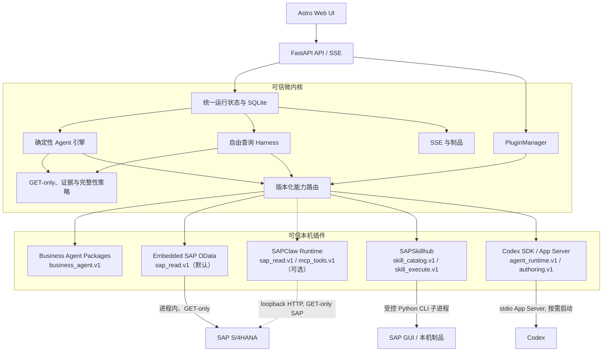

# SAPBusinessAgents 本机插件平台

## 目标与边界

本机原型采用 Python/FastAPI 微内核，不引入 Cordis。插件化用于隔离能力和依赖，不改变两种执行模式的业务语义：

- 固定 Agent 仍由核心确定性工作流引擎执行，Codex Runtime 插件不会参与工具选择。
- 自由查询通过 `agent_runtime.v1` 取得 Codex 结构化计划，再由核心调用已注册的只读能力。
- SAP 写入、任意 Shell、任意代码、远程插件地址和运行时下载依赖全部被清单校验拒绝。
- 插件扫描只读取 JSON 清单；清单不能自动加载 Python 模块。可执行 Provider 必须由可信核心显式绑定。

## 架构



业务代码只请求 `sap_read.v1`，不引用具体实现。默认 Embedded Provider 在微内核进程内直接执行 SAP GET；SAPClaw 是默认禁用的外部兼容 Provider。SAPSkillhub Skill 使用标准 CLI 子进程，Codex SDK 控制独立 App Server。一次运行只能使用一个明确选择的 SAP Provider，禁止静默回退和混合证据。

Embedded Provider 会保存 SAP `$metadata` 中的 `sap:filterable` 原始注解，并把它视为兼容性提示：当前目标 SAP Gateway 已验证部分标为 `false` 的字段仍可正确执行 `$filter`。`sap:sortable=false` 仍然严格生效，因为完整分页依赖稳定排序键；如果实体没有可排序键，Provider 只在单页明确结束时报告完整，否则返回不完整。实体和字段存在性仍由实时元数据强制校验；实际 GET 若被后端拒绝则原样失败，不会改用全表扫描或静默回退。

## 能力契约

| 插件 | 能力 | 当前操作 |
|---|---|---|
| Business Agent Packages | `business_agent.v1` | `list`, `executable`, `get`, `validate` |
| Embedded SAP OData | `sap_read.v1` | `health`, `catalog`, `guidance`, `schema`, `validate_plan`, `execute_plan`, `execute_get`, `page` |
| SAPClaw Runtime | `sap_read.v1` | `health`, `catalog`, `guidance`, `schema`, `validate_plan`, `execute_plan`, `execute_get`, `page` |
| SAPClaw Runtime | `mcp_tools.v1` | `catalog`, `schema`, `validate_plan`, `execute_plan`, `execute_get`, `page` |
| SAPSkillhub | `skill_catalog.v1` | `list`, `get` |
| SAPSkillhub | `skill_execute.v1` | `execute` |
| Codex Runtime | `agent_runtime.v1` | `plan`, `summarize` |
| Codex Runtime | `authoring.v1` | `author_draft` |

`mcp_tools.v1` 仅用于保留 SAPClaw v2 Thin Runtime 的兼容工具面。固定 Agent 和自由查询统一面向 `sap_read.v1`；通过 `SAP_READ_PROVIDER=embedded|sapclaw` 明确选择实现。默认值是 `embedded`，且不会因失败自动切换到 SAPClaw。

## 清单格式

清单位于 `config/plugins/*.json`。示例：

```json
{
  "schema_version": "1.0",
  "plugin_id": "embedded-sap-odata",
  "version": "1.0.0",
  "name": {"zh": "内嵌 SAP 只读连接器", "en": "Embedded SAP Read-only Provider"},
  "publisher": "SAPBusinessAgents",
  "enabled": true,
  "capabilities": [
    {
      "capability": "sap_read.v1",
      "operations": ["health", "catalog", "validate_plan", "execute_plan"]
    }
  ],
  "transport": {"type": "builtin", "loopback_only": true},
  "permissions": {
    "sap_read": true,
    "sap_write": false,
    "arbitrary_shell": false,
    "arbitrary_code": false,
    "filesystem_write": false
  }
}
```

插件启停覆盖值存储在 `.local-data/plugins/registry.json`，不会修改版本化清单。

## 生命周期

```text
discovered → starting → ready
                    ↘ degraded
                    ↘ failed
ready/degraded → disabled → starting
ready/degraded → stopped
```

- `rescan` 只重新校验清单和能力，不执行未知代码。
- `health` 检查 Provider 配置和只读边界；Embedded Provider 不在启动健康检查中发送业务查询。
- SAPClaw 只有显式选择后才启用，并且必须同时报告 Runtime ready 和 `read_only=true`。
- `disabled` 插件不能解析能力。停用 Codex 不影响固定 Agent，但自由查询会以 `capability_unavailable` 失败。
- `SAP_READ_PROVIDER` 是 SAP 能力的唯一选择器；选中的 Provider 不可用时失败关闭，不自动调用另一个 Provider。

## 审计记录

每个产生证据的插件调用写入：

```text
plugin_id
plugin_version
capability
operation
call_id
duration_ms
step_id
status
```

相同 `call_id` 同时出现在 `tool_calls[]` 和 `evidence[]`。SAP 返回的 `source_complete` 仍单独决定最终 `completed` 或 `inconclusive`；插件健康或调用成功不能替代业务完整性结论。

## 本机 API

```text
GET  /api/plugins
GET  /api/plugins/{plugin_id}
GET  /api/capabilities
GET  /api/providers/sap-read
POST /api/providers/sap-read/{provider_id}/health
POST /api/plugins/rescan
POST /api/plugins/{plugin_id}/health
PUT  /api/plugins/{plugin_id}/enabled
```

现有 `/api/agents`、`/api/runs`、SSE、工具目录和 Agent Factory 接口保持兼容。

## SAPClaw 淘汰状态

1. 全部 21 个可执行 Agent 清单已经采用 Schema v2 和 `executor: sap_read`；P2P/O2C 之外的 19 个 Agent 也已具备确定性 GET-only 执行步骤与规则。
2. Agent Factory 只生成 `sap_read`；旧名称仍可读取，但会逐步移除。
3. 一键启动器默认不查找、不启动 SAPClaw。
4. `/api/tools/sapclaw` 仅保留为带弃用响应头的兼容别名。
5. SAPClaw Provider 默认禁用，只能通过 `SAP_READ_PROVIDER=sapclaw` 显式启用。
6. 2026-08-16 真机对比已完成：Embedded Provider 的 P2P/O2C 固定与自由查询均完成；SAPClaw 的 P2P 固定通过，但 O2C 固定仍被 `stable_paging_key_unavailable` 阻塞，本轮未发现 SAPClaw 独有能力。
7. 2026-08-17 已用 embedded Provider 对其余 19 个固定 Agent 完成真机 GET-only 验收；所有 Agent 均发出真实 GET，能力与测试数据不足按 `inconclusive` 和缺口记录处理。
8. 当前进入兼容观察期。确认没有本地工作流继续选择 `SAP_READ_PROVIDER=sapclaw` 后，再删除 SAPClaw client、Provider 清单、旧配置、旧接口和兼容执行器；删除前不做静默回退。

## 第一版明确不做

- 远程市场、在线安装和自动升级。
- 未签名第三方插件的动态代码加载。
- 热重载正在运行的任务。
- 自动下载 Python、Node 或二进制依赖。
- SAP 写操作或非只读 Skill。

这些边界让插件平台先验证架构价值，同时保留可复核的只读执行链。
