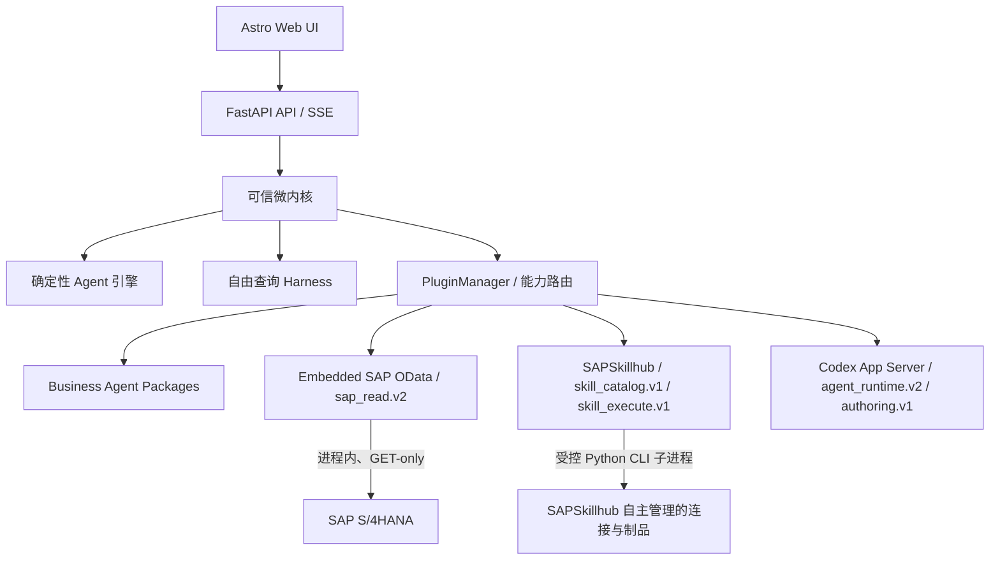

# SAPBusinessAgents 本机插件平台

## 目标与边界

本机原型采用 Python/FastAPI 微内核，不引入 Cordis。插件化用于隔离能力和依赖，不改变执行语义：

- 固定 Agent 由核心确定性工作流引擎执行，Codex Runtime 不参与工具选择。
- 自由查询默认通过 `agent_runtime.v2` 的 Codex App Server Harness 进行多轮工具调用、观察和查询修订；SAP 查询仍只能由核心 Embedded Provider 执行。
- SAP 写入、任意 Shell、任意代码、远程插件地址和运行时下载依赖全部被清单校验拒绝。
- 插件扫描只读取 JSON 清单；可执行 Provider 必须由可信核心显式绑定。

## 架构



SAP 数据读取固定由 Embedded Provider 在微内核进程内执行。SAPSkillhub Skill 使用标准 CLI 子进程，并自行管理连接配置；SAPBusinessAgents 只传递有界业务输入。运行时不提供第二个 SAP Provider，也不存在自动或手动回退。

Embedded Provider 保存 SAP `$metadata` 中的 `sap:filterable` 原始注解，并把它作为兼容性提示。`sap:sortable=false` 严格生效，因为完整分页依赖稳定排序键；没有可排序键时，只有明确单页结束才能报告完整。实体和字段存在性由实时元数据强制校验，实际 GET 被后端拒绝时原样失败，不会改成全表扫描。

## 能力契约

| 插件 | 能力 | 当前操作 |
|---|---|---|
| Business Agent Packages | `business_agent.v1` | `list`, `executable`, `get`, `validate` |
| Embedded SAP OData | `sap_read.v2` | `health`, `catalog`, `guidance`, `schema`, `validate_plan`, `execute_plan`, `execute_get`, `page` |
| SAPSkillhub | `skill_catalog.v1` | `list`, `get` |
| SAPSkillhub | `skill_execute.v1` | `execute` |
| Codex Harness | `agent_runtime.v2` | persistent thread、steer、interrupt、Web Search、MCP 工具循环 |
| Codex Runtime | `authoring.v1` | `author_draft` |

固定 Agent 和自由查询统一面向 `sap_read.v2`；唯一实现是 `embedded-sap-odata`。

## 清单与生命周期

清单位于 `config/plugins/*.json`。清单必须声明版本、能力、传输方式和安全权限。插件启停覆盖值存储在 `.local-data/plugins/registry.json`，不会修改版本化清单。

```text
discovered → starting → ready
                    ↘ degraded
                    ↘ failed
ready/degraded → disabled → starting
ready/degraded → stopped
```

- `rescan` 只重新校验清单和能力，不执行未知代码。
- `health` 检查配置和只读边界；Embedded Provider 的启动健康检查不发送业务查询。
- `disabled` 插件不能解析能力。停用 Codex 不影响固定 Agent，但自由查询会以 `capability_unavailable` 失败。
- Embedded Provider 不允许被关闭或替换为其他 SAP 读取实现。

## 审计记录

每个产生证据的插件调用记录 `plugin_id`、`plugin_version`、`capability`、`operation`、`call_id`、`duration_ms`、`step_id` 和 `status`。相同 `call_id` 同时出现在 `tool_calls[]` 与 `evidence[]`。SAP 返回的 `source_complete` 单独决定最终 `completed` 或 `inconclusive`；健康或 HTTP 成功不能替代业务完整性结论。

## 本机 API

```text
GET  /api/plugins
GET  /api/plugins/{plugin_id}
GET  /api/capabilities
GET  /api/providers/sap-read
POST /api/providers/sap-read/{provider_id}/health
POST /api/plugins/rescan
POST /api/plugins/{plugin_id}/health
PUT  /api/plugins/{plugin_id}/enabled
```

`/api/providers/sap-read` 固定返回 `selected_provider=embedded`、`selected_plugin_id=embedded-sap-odata`、`automatic_fallback=false`。

## 明确不做

- 远程市场、在线安装和自动升级。
- 未签名第三方插件的动态代码加载。
- 热重载正在运行的任务。
- 自动下载 Python、Node 或二进制依赖。
- SAP 写操作或非只读 Skill。
