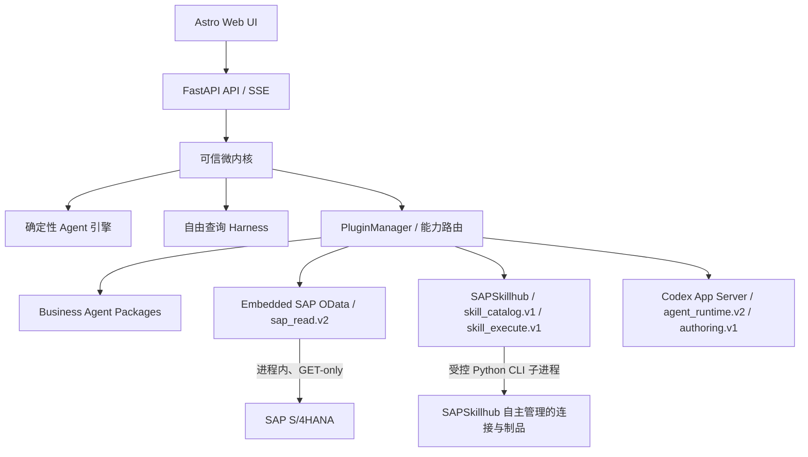

# SAPBusinessAgents 本机插件平台

## 目标与边界

本机原型采用 Python/FastAPI 微内核，不引入 Cordis。插件化用于隔离能力和依赖，不改变执行语义：

- 固定 Agent 由核心确定性工作流引擎执行，任何 Agent Runtime 都不参与工具选择。
- 自由查询默认通过 `agent_runtime.v2` 的 Codex App Server Harness 进行多轮工具调用、观察和查询修订；SAP 查询仍只能由核心 Embedded Provider 执行。
- SAP 写入、任意 Shell、任意代码、远程插件地址和运行时下载依赖全部被清单校验拒绝。
- 插件扫描只读取 JSON 清单；可执行 Provider 必须由可信核心显式绑定。

## 架构


```mermaid
flowchart TB
    UI["Astro Web UI"] --> API["FastAPI API / SSE"]
    API --> CORE["可信微内核"]
    CORE --> FIXED["确定性 Agent 引擎"]
    CORE --> FREE["自由查询 Harness"]
    CORE --> REGISTRY["PluginManager / 能力路由"]
    REGISTRY --> AGENT["Business Agent Packages"]
    REGISTRY --> EMBEDDED["Embedded SAP OData / sap_read.v2"]
    REGISTRY --> SKILLS["SAPSkillhub / skill_catalog.v1 / skill_execute.v1"]
    REGISTRY --> CODEX["Codex App Server / agent_runtime.v2 / authoring.v1"]
    EMBEDDED -->|"进程内、GET-only"| SAP["SAP S/4HANA"]
    SKILLS -->|"受控 Python CLI 子进程"| LOCAL["SAPSkillhub 自主管理的连接与制品"]
```

SAP 数据读取固定由 Embedded Provider 在微内核进程内执行。SAPSkillhub Skill 使用标准 CLI 子进程，并自行管理连接配置；SAPBusinessAgents 只传递有界业务输入。运行时不提供第二个 SAP Provider，也不存在自动或手动回退。

Embedded Provider 保存 SAP `$metadata` 中的 `sap:filterable` 原始注解，并把它作为兼容性提示。`sap:sortable=false` 严格生效，因为完整分页依赖稳定排序键；没有可排序键时，只有明确单页结束才能报告完整。实体和字段存在性由实时元数据强制校验，实际 GET 被后端拒绝时原样失败，不会改成全表扫描。

## 能力契约

| 插件 | 能力 | 当前操作 |
|---|---|---|
| Business Agent Packages | `business_agent.v1` | `list`, `executable`, `get`, `validate` |
| Embedded SAP OData | `sap_read.v2` | `health`, `catalog`, `guidance`, `schema`, `validate_plan`, `execute_plan`, `execute_get`, `page` |
| SAPSkillhub | `skill_catalog.v1` | `list`, `get` |
| SAPSkillhub | `skill_execute.v1` | `execute` |
| Codex Harness | `agent_runtime.v2` | persistent thread、steer、interrupt、Web Search、MCP 工具循环 |
| Agent Runtime Router | `authoring.v1` | `author_draft` |

固定 Agent 和自由查询统一面向 `sap_read.v2`；唯一实现是 `embedded-sap-odata`。

## 清单与生命周期

清单位于 `config/plugins/*.json`。清单必须声明版本、能力、传输方式和安全权限。插件启停覆盖值存储在 `.local-data/plugins/registry.json`，不会修改版本化清单。

```text
discovered → starting → ready
                    ↘ degraded
                    ↘ failed
ready/degraded → disabled → starting
ready/degraded → stopped
```

- `rescan` 只重新校验清单和能力，不执行未知代码。
- `health` 检查配置和只读边界；Embedded Provider 的启动健康检查不发送业务查询。
- `disabled` 插件不能解析能力。停用 Codex 不影响固定 Agent，但自由查询会以 `capability_unavailable` 失败。
- Embedded Provider 不允许被关闭或替换为其他 SAP 读取实现。

## 审计记录

每个产生证据的插件调用记录 `plugin_id`、`plugin_version`、`capability`、`operation`、`call_id`、`duration_ms`、`step_id` 和 `status`。相同 `call_id` 同时出现在 `tool_calls[]` 与 `evidence[]`。SAP 返回的 `source_complete` 单独决定最终 `completed` 或 `inconclusive`；健康或 HTTP 成功不能替代业务完整性结论。

## 本机 API

```text
GET  /api/plugins
GET  /api/plugins/{plugin_id}
GET  /api/capabilities
GET  /api/providers/sap-read
POST /api/providers/sap-read/{provider_id}/health
POST /api/plugins/rescan
POST /api/plugins/{plugin_id}/health
PUT  /api/plugins/{plugin_id}/enabled
```

`/api/providers/sap-read` 固定返回 `selected_provider=embedded`、`selected_plugin_id=embedded-sap-odata`、`automatic_fallback=false`。

## 明确不做

- 远程市场、在线安装和自动升级。
- 未签名第三方插件的动态代码加载。
- 热重载正在运行的任务。
- 自动下载 Python、Node 或二进制依赖。
- SAP 写操作或非只读 Skill。

## 用户入口 / User entry point

从“插件与连接”查看插件状态、健康与能力；从“系统配置”管理Agent Runtime与模型。插件已安装、已启用和对应能力已经验证是不同条件。配置缺失或依赖漂移时先处理阻塞，不把目录存在解释为可以运行。

Use Plugins and connections for plugin status, health and capabilities, and System settings for Agent Runtime/models. Installed, enabled and accepted are separate conditions. Resolve missing configuration or dependency drift before running; catalog presence does not establish readiness. Mail operations require their own bindings and per-send confirmation, independently of SAP's read-only boundary.

See [Runtime settings](runtime-settings.md) and [connection/mail guidance](runtime-integrations.md).

## 查询历史 / Query history

自由查询页的“历史查询记录”按钮打开会话列表，每页 20 条。仅用户主动提交的查询自动保存，同一会话的追问合并为一条历史；最后一轮查询结束后起算保留期限，默认 30 天，可在“系统配置 → 查询历史”修改。查看、确认结果和生成草稿不重置期限。

三级验收（包括直接基线和自由查询对照）、样本发现等系统任务不计入查询历史，也不受查询历史到期清理影响；其运行证据继续保留供验收和审计使用。来源由后端持久化为 `query_origin`，追问继承原会话来源，客户端不能指定该标记。已有记录根据验收、样本发现和用户提交事件进行迁移；无法确认由用户提交的旧记录不计入历史。

服务启动时及每分钟检查到期历史，删除会话、查询轮次、事件、受限数据和运行制品。正在执行或用于草稿生成的源记录受到保护；等待补充信息的到期任务先取消，清理失败会自动重试。已经生成的 Agent 草稿及其管理记录继续保留。

只有最新查询成功、证据完整且执行计划有效时才能转为 Agent 草稿。失败、取消、未完成或结论不充分的查询会显示“重新查询 / 放弃转换”；重新查询预填原问题、追问和公开补充信息，由用户确认后建立新会话。安全参数需要重新输入。生成的草稿仍需编辑、校验和正式验收。

The free-query page opens a session history list with 20 rows per page. Only user-submitted queries and their follow-ups are saved automatically and retained for 30 days after the last round finishes; retention is configurable in System settings. System acceptance (including direct baselines and free-query comparisons) and sample discovery tasks are excluded from history and its expiry cleanup; their execution evidence remains available for acceptance and audit. The server persists the origin and feedback inherits it. Legacy records are classified using acceptance, discovery and submission evidence; records without confirmed user provenance are excluded. Startup and minute-based cleanup retries failures, protects active authoring sources, and preserves generated drafts. Conversion requires a successful latest query, complete evidence and a valid replayable plan. Retrying prefills public question history and waits for user confirmation before starting a new session.

```text
GET /api/free-query-sessions?limit=20&offset=0
GET /api/free-query-history/{history_id}/retry-query
GET /api/system/free-query-history
PUT /api/system/free-query-history  {"retention_days": 30}
```
