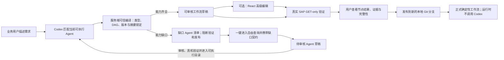

# 用户自定义工作流 / User-defined workflows

本机平台允许业务用户先用自然语言描述目标，再由当前 Agent Runtime 从仓库的**可执行固定 Agent**中提出组合建议。服务端把建议视为不可信输入，重新固定 Agent 版本与摘要、校验类型、补齐工作流输入并编译成严格只读 DAG。高级用户仍可打开可视化画布手工调整。Schema v2 支持 `foreach` 和由上游非空集合驱动的 `runIf` 条件节点；compiler v4 要求条件终端节点通过 `onSkip` 返回显式的不确定终态，并自动剔除未被下游消费的输入回显字段，不允许把 `query_mode`、日期等执行上下文伪装成业务终态输出。不支持任意条件表达式、嵌套工作流或 SAP 写操作。



## 四步向导

点击顶部“我的工作流”后，默认进入“已发布工作流”目录。目录从本机API实时读取正式工作流，展示名称、版本、只读状态、业务步骤数量和最近一次发布验证结论；选择工作流后可以查看业务步骤、输入输出、完整性缺口并填写输入直接运行。没有历史发布验证文件的旧工作流明确显示“发布验证记录不可用”，不会被标记为验证通过。通过“创建工作流”进入以下四步向导；发布成功后自动返回新工作流的正式详情页。

正式工作流分为“使用中”和“已停用”两个列表。详情页提供以下管理操作：

- **创建新版本**：选择补丁、次版本或主版本递增，将当前定义复制为独立草稿。当前正式版本保持不变，新草稿必须重新完成预审、真机验证和发布。
- **停用/重新启用**：停用后拒绝新运行，但正在运行的任务继续使用已经保存的工作流快照，历史运行和历史版本保持可查看。重新启用不会绕过Agent版本与Digest检查。
- **永久删除**：只允许删除已经停用、没有正式业务运行、没有未完成版本草稿且没有其他正式定义引用的工作流。发布前真机验证不计为正式业务运行。删除不会重写Git历史。

版本发布会把原正式文件保存到`versions/<version>/`，根目录只保留当前可执行版本。管理正式目录前必须保持Git工作区干净；平台创建本地`codex/workflow-*`分支并留下待提交修改，不自动提交或推送。

1. **生成草稿**：打开“我的工作流”，用一句话描述要完成的业务任务。订单号、公司代码和日期等具体值只作为真机验证预填值，不会固化成正式工作流常量。生成完成后页面会持久显示“草稿已生成”、业务步骤数量和“下一步：检查工作流”；刷新、切换语言或重新打开草稿后仍能看到该引导。
2. Codex 读取当前仓库中状态为可执行且声明了输入、输出契约的 Agent。高置信匹配才会进入草稿；关键歧义会一次只追问一个问题。
3. 服务端重新编译建议：固定每个 Agent 的版本与执行摘要，仅对同名且类型兼容的上下游端口自动连接；遇到 `oneOf` 时必须选择唯一分支并注入显式模式常量。上游数组可能为空、下游要求非空时，编译器增加 `runIf=non_empty`，不会把空数组交给下游 Agent；终端节点同时生成类型安全的 `onSkip` 输出，并把最终业务状态、报告和完整性字段保持为必需。Runtime误请求未消费的输入回显字段时，compiler v4会移除终态投影并在`output_normalization.dismissed_requested_outputs`中留痕；真实业务输出或下游消费字段无法安全跳过时仍阻止生成。
4. **检查工作流**：如果能力齐全，检查自动编排结果。需要精细控制时打开“高级编辑”，在画布上调整节点、端口映射或常量并保存版本。
5. 如果存在缺口，页面列出缺口 Agent 的功能、输入、输出、只读护栏和验收要求。缺口未解决前，真机验证和发布均被服务端阻断。
6. 点击“用自由查询创建此 Agent”。系统把缺口契约预填到自由查询；查询完成后点击“保存为 Agent 草稿”。该草稿保留来源工作流和缺口编号，默认进入 `needs_review`，不是可执行目录条目。
7. 缺口 Agent 完成业务复核、契约复核和真实 SAP GET-only 验证并进入可执行目录后，返回原工作流页面。页面会根据新的目录摘要自动重新匹配；目录未变化时不会反复调用 Codex。
8. **真机验证**：检查或填写样本，也可以增加可选的终端输出预期。平台先完成结构与 Schema 校验，再把服务端生成的版本化 `review_contract` 交给 Agent Runtime；只有设计预审通过，才允许执行有界 GET-only 自动样本发现、创建验证运行和读取 SAP。`review_contract` 只要求工作流必需终态输出和下游实际消费的条件节点输出，不把 Agent Schema 中未暴露、未消费的字段扩张为 `onSkip` 义务。采购订单、销售订单及对应数组输入留空时，预审请求只标记为 `auto_discover`，预审通过后平台才查询一个现有单据；查询基准日留空时使用运行当天。Agent Runtime 的 `pass/block` 只标记“设计预审”，不代表真机验证结论。
9. 真机运行结束后，平台根据节点、只读调用、必需输出、完整性传播和用户预期生成确定性验证报告。`pass`、`inconclusive`、`fail`和`blocked`分别显示；业务状态为`attention`不自动等于验证失败。
10. **发布工作流**：`pass`可直接发布；`inconclusive`必须逐项查看并确认当前报告中的证据缺口。确认绑定当前运行编号、报告Digest和完整缺口代码，不能把结果改为`pass`。`fail`或`blocked`不能发布。发布仍要求 Git 工作区干净，创建新的本地分支，不自动提交、推送或创建PR。

## 运行与安全边界

- 正式工作流通过 `POST /api/runs` 使用 `mode=workflow` 和 `workflowId` 执行。
- 发布和每次执行都会重新核对 Agent 版本与摘要；发生漂移时失败关闭并要求重新验证。
- Codex 的 Agent 选择和映射建议不能直接执行；服务端只接受当前可执行目录中的精确 Agent ID，并重新验证类型、必填端口、DAG、版本摘要与 GET-only 边界。
- Runtime 预审结论会同时保存原始结论、有效结论、阻塞问题和被平台契约证明不适用的问题。只有 `review_contract` 确实要求且工作流确实缺少的条件输出才能阻塞；被驳回的模型误报仍保留在 `dismissed_issues` 中供审计。
- Runtime组合建议在编译前保存为本地`proposal_snapshot`。可恢复的旧compiler失败草稿可以通过原草稿的“重新生成草稿”操作升级，不要求用户重新输入业务目标。
- Runtime 阻塞、超时或返回无效结构时，平台不会自动发现样本、不会读取 SAP、也不会创建验证运行；页面直接显示双语问题代码、节点和端口。
- 中置信或低置信匹配不会被“猜成”现有 Agent，而是转为显式缺口。任何未解决缺口都会阻断验证和发布。
- 自由查询只生成隔离的 Agent 草稿。缺口契约不满足、确定性规则未复核或真机证据未达标时，草稿不能进入可执行目录。
- 节点只能调用 Agent 清单中预定义的 GET-only API、已批准只读 Skill 和确定性规则。
- 条件节点因空集合跳过时，不创建子运行；已取得的上游结果继续返回，但整个工作流固定为 `inconclusive`，且 `source_complete=false`、`business_complete=false`。
- 自动样本发现只读取最多 50 个有稳定排序的候选键，并仅选择满足输入 Schema 最小数量的候选。发现结果不是业务完整性证据；没有候选或字段不受支持时，页面会明确列出需要手工填写的必填输入。
- 工作流成功运行只表示编排技术链路完成，不自动证明 SAP 业务流程完成；源数据完整性和业务完整性分别保留。
- 验证报告保存为工作流草稿的本地JSON和Markdown制品；发布记录只保留报告Digest、结论和已确认缺口，不复制原始SAP数据。
- 草稿只写入 `.prototype/authoring/workflows/`，运行快照、节点子运行和 SSE 事件保存在 `.local-data/`。

## API

```text
GET  /api/workflows
GET  /api/workflows/catalog
GET  /api/workflows/{workflow_id}
GET  /api/workflows/{workflow_id}/versions
GET  /api/workflows/{workflow_id}/versions/{version}
POST /api/workflows/{workflow_id}/versions/draft
POST /api/workflows/{workflow_id}/deactivate
POST /api/workflows/{workflow_id}/activate
DELETE /api/workflows/{workflow_id}
POST /api/authoring/workflows
POST /api/authoring/workflows/compose
GET  /api/authoring/workflows/{draft_id}
PUT  /api/authoring/workflows/{draft_id}
GET  /api/authoring/workflows/{draft_id}/revisions
POST /api/authoring/workflows/{draft_id}/composition-input
POST /api/authoring/workflows/{draft_id}/reconcile
GET  /api/authoring/workflows/{draft_id}/gaps/{gap_id}
POST /api/authoring/workflows/{draft_id}/validate
GET  /api/authoring/workflows/{draft_id}/validation-report
GET  /api/authoring/workflows/{draft_id}/validation-artifacts/{name}
POST /api/authoring/workflows/{draft_id}/publish
POST /api/runs/{run_id}/create-agent-draft
```

## English summary

The natural-language-first builder asks Codex to match only currently executable repository Agents. A trusted server-side compiler pins each version and digest, validates ports and the DAG, and turns uncertain matches into explicit blocking gaps. A gap can open a prefilled read-only free query and preserve its contract in a review-only Agent draft. Live validation executes the real fixed Agents against GET-only SAP data. Published executions never invoke Codex and fail closed if a pinned Agent drifts.
