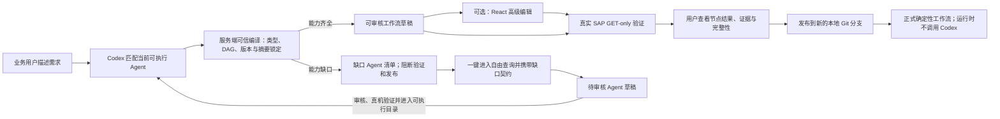

# 用户自定义工作流 / User-defined workflows

本机平台允许业务用户先用自然语言描述目标，再由 Codex 从当前仓库的**可执行固定 Agent**中提出组合建议。服务端把建议视为不可信输入，重新固定 Agent 版本与摘要、校验类型、补齐工作流输入并编译成严格只读 DAG。高级用户仍可打开可视化画布手工调整。当前不支持条件分支、循环、嵌套工作流或 SAP 写操作。



## 使用流程

1. 打开“我的工作流”，用一句话描述要完成的业务任务。订单号、公司代码和日期等具体值只作为真机验证预填值，不会固化成正式工作流常量。
2. Codex 读取当前仓库中状态为可执行且声明了输入、输出契约的 Agent。高置信匹配才会进入草稿；关键歧义会一次只追问一个问题。
3. 服务端重新编译建议：固定每个 Agent 的版本与执行摘要，仅对同名且类型兼容的上下游端口自动连接；其余必填项提升为工作流输入。
4. 如果能力齐全，检查自动编排结果。需要精细控制时打开“高级编辑”，在画布上调整节点、端口映射或常量并保存版本。
5. 如果存在缺口，页面列出缺口 Agent 的功能、输入、输出、只读护栏和验收要求。缺口未解决前，真机验证和发布均被服务端阻断。
6. 点击“用自由查询创建此 Agent”。系统把缺口契约预填到自由查询；查询完成后点击“保存为 Agent 草稿”。该草稿保留来源工作流和缺口编号，默认进入 `needs_review`，不是可执行目录条目。
7. 缺口 Agent 完成业务复核、契约复核和真实 SAP GET-only 验证并进入可执行目录后，返回原工作流页面。页面会根据新的目录摘要自动重新匹配；目录未变化时不会反复调用 Codex。
8. 在“真机验证输入”中检查预填样本，点击“Codex 真机验证”。Codex 只复核连接和映射，真实执行仍由确定性引擎完成。
9. 查看验证运行。某个节点结果为 `inconclusive` 时，只要下游必需输出仍存在，工作流可以继续，但最终结果保持 `inconclusive`。
10. 验证满意后发布。发布要求 Git 工作区干净；系统创建 `codex/workflow-<id>-v<version>` 分支，并写入 `workflows/Common/<id>/`，不会自动提交、推送或创建 PR。

## 运行与安全边界

- 正式工作流通过 `POST /api/runs` 使用 `mode=workflow` 和 `workflowId` 执行。
- 发布和每次执行都会重新核对 Agent 版本与摘要；发生漂移时失败关闭并要求重新验证。
- Codex 的 Agent 选择和映射建议不能直接执行；服务端只接受当前可执行目录中的精确 Agent ID，并重新验证类型、必填端口、DAG、版本摘要与 GET-only 边界。
- 中置信或低置信匹配不会被“猜成”现有 Agent，而是转为显式缺口。任何未解决缺口都会阻断验证和发布。
- 自由查询只生成隔离的 Agent 草稿。缺口契约不满足、确定性规则未复核或真机证据未达标时，草稿不能进入可执行目录。
- 节点只能调用 Agent 清单中预定义的 GET-only API、已批准只读 Skill 和确定性规则。
- 工作流成功运行只表示编排技术链路完成，不自动证明 SAP 业务流程完成；源数据完整性和业务完整性分别保留。
- 草稿只写入 `.prototype/authoring/workflows/`，运行快照、节点子运行和 SSE 事件保存在 `.local-data/`。

## API

```text
GET  /api/workflows
GET  /api/workflows/{workflow_id}
POST /api/authoring/workflows
POST /api/authoring/workflows/compose
GET  /api/authoring/workflows/{draft_id}
PUT  /api/authoring/workflows/{draft_id}
GET  /api/authoring/workflows/{draft_id}/revisions
POST /api/authoring/workflows/{draft_id}/composition-input
POST /api/authoring/workflows/{draft_id}/reconcile
GET  /api/authoring/workflows/{draft_id}/gaps/{gap_id}
POST /api/authoring/workflows/{draft_id}/validate
POST /api/authoring/workflows/{draft_id}/publish
POST /api/runs/{run_id}/create-agent-draft
```

## English summary

The natural-language-first builder asks Codex to match only currently executable repository Agents. A trusted server-side compiler pins each version and digest, validates ports and the DAG, and turns uncertain matches into explicit blocking gaps. A gap can open a prefilled read-only free query and preserve its contract in a review-only Agent draft. Live validation executes the real fixed Agents against GET-only SAP data. Published executions never invoke Codex and fail closed if a pinned Agent drifts.
