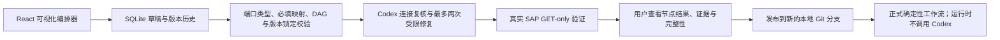

# 用户自定义工作流 / User-defined workflows

本机平台允许业务用户把多个已发布的固定 Agent 连接成一个新的严格只读工作流。第一版只支持有向无环图；不支持条件分支、循环、嵌套工作流或 SAP 写操作。



## 使用流程

1. 打开“我的工作流”，从左侧加入已声明 `execution.outputSchema` 的固定 Agent。
2. 在画布上连接输出端口和下游输入端口，或在右侧选择工作流输入、上游输出或常量。
3. 保存草稿。服务会为每个节点固定 Agent 版本和执行摘要，并保存每次修改的 JSON 差异。
4. 在“真机验证输入”中填写已知样本；留空时平台只会为已支持的关键字段执行有界 GET 候选发现。
5. 点击“Codex 真机验证”。Codex 只复核连接和映射，不能增加或删除节点、替换 Agent 或改变 Agent 版本。真实执行仍由确定性引擎完成。
6. 查看验证运行。某个节点结果为 `inconclusive` 时，只要下游必需输出仍存在，工作流可以继续，但最终结果保持 `inconclusive`。
7. 验证满意后发布。发布要求 Git 工作区干净；系统创建 `codex/workflow-<id>-v<version>` 分支，并写入 `workflows/Common/<id>/`，不会自动提交、推送或创建 PR。

## 运行与安全边界

- 正式工作流通过 `POST /api/runs` 使用 `mode=workflow` 和 `workflowId` 执行。
- 发布和每次执行都会重新核对 Agent 版本与摘要；发生漂移时失败关闭并要求重新验证。
- 节点只能调用 Agent 清单中预定义的 GET-only API、已批准只读 Skill 和确定性规则。
- 工作流成功运行只表示编排技术链路完成，不自动证明 SAP 业务流程完成；源数据完整性和业务完整性分别保留。
- 草稿只写入 `.prototype/authoring/workflows/`，运行快照、节点子运行和 SSE 事件保存在 `.local-data/`。

## API

```text
GET  /api/workflows
GET  /api/workflows/{workflow_id}
POST /api/authoring/workflows
GET  /api/authoring/workflows/{draft_id}
PUT  /api/authoring/workflows/{draft_id}
GET  /api/authoring/workflows/{draft_id}/revisions
POST /api/authoring/workflows/{draft_id}/validate
POST /api/authoring/workflows/{draft_id}/publish
```

## English summary

The local platform composes pinned deterministic Agents as a read-only DAG. Codex may review or repair connections only during authoring, with at most two repair attempts. Live validation executes the real fixed Agents against GET-only SAP data. Publishing writes a versioned immutable definition on a new local Git branch. Published executions never invoke Codex and fail closed if any pinned Agent version or digest has drifted.
